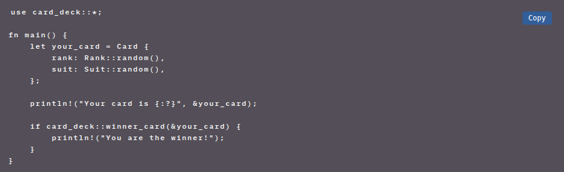

## 🧩 01-copy

A lightweight Chrome extension that automatically adds a **"Copy" button** to all `<code>` blocks on [learn.zone01oujda.ma](https://learn.zone01oujda.ma), making it super easy to copy code snippets with a single click.



---

### 🚀 Features

- ✂️ Adds a floating "Copy" button to every `<code>` block
- 📋 Copies code to clipboard instantly
- 🎨 Beautiful dark theme styling inspired by VS Code
- ⚡ Works on dynamic pages (SPA support via MutationObserver)
- 🔒 Runs **only** on https://learn.zone01oujda.ma for privacy

---

### 🔧 How to Install

1. Clone or download this repo:

    ```bash
    git clone https://github.com/anas-ou/01-copy.git
    ```

2. Open Chrome, and navigate to:

    ```shell
    chrome://extensions/
    ```
3. In the top-right corner, enable Developer mode

4. Click the "Load unpacked" button

5. Select the folder where you downloaded or cloned the extension

6. Visit https://learn.zone01oujda.ma and hover over any `<code>` block — you’ll see a "Copy" button in the corner!


### 📁 File Structure
---

```shell
01-copy/
├── manifest.json
├── content.js
├── style.css
├── icon.png
├── preview.png
└── README.md
```

### 🤝 Contribute
---

Have ideas to make this extension better? Want to add syntax highlighting, theming, keyboard shortcuts, or support for other platforms?

You're very welcome to contribute!

- Fork the repo

- Make your changes

- Open a Pull Request 🚀

Feel free to open issues or suggest features as well.

### 📄 License
---

MIT License — Free to use, modify, and share.

Made with ❤️ for fellow learners at Zone01 Oujda.
